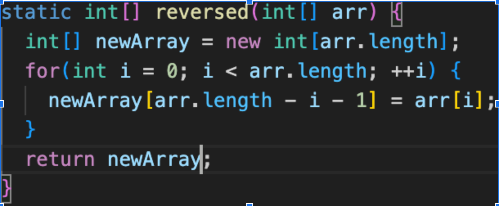
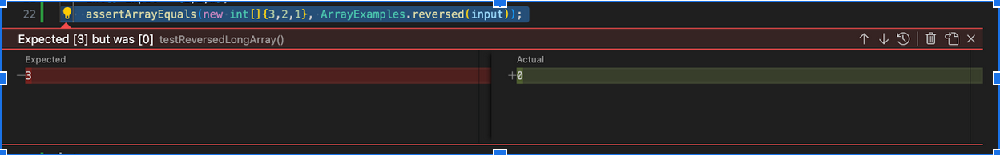

# Lab Report 5

## Part 1

### Buggy Code



### JUnit Test Fail

```
@Test
public void reveredBig() {
  int [] input = {1,2,3};
  asserEquals(new int[] {3,2,1}, ArrayExamples.reversed(input));
}
```

### JUnit Test Pass

```
@Test
public void reveredSmall() {
  int [] input = {1};
  asserEquals(new int[] {1}, ArrayExamples.reversed(input));
}
```

### Fail Output


### Bug Before Fix

```
for(int i = 0; i < arr.length; ++i) {
  newArray[arr.length - i - 1] = arr[i];
}
```

### Fixed Code
```
for(int i = 0; i < arr.length/2; i += 1) {
  int temp = arr[i];
  arr[i] = arr[arr.length - i - 1];
  arr[arr.length - i - 1] = temp;
}
```

## Part 2

## `find` Command

The -H, -L and -P options control the treatment of symbolic links. Arguments following these are taken to be names of files or directories to be examined, up to the first argument that begins with "-", or the argument "(" or "!". That argument and any following arguments are taken to be the expression describing what is being searched. If no paths are given, the current directory is used. If no expression is given, the expression -print is used (but consider using -print0 instead. More information on this below).

The arguments in the expression list are also referred to as "options," but the five "real" options -H, -L, -P, -D and -O must appear before the first path name, if they are used at all. A double-dash ("--") can also be used to signal that any remaining arguments are not options (though ensuring that all start points begin with either "./" or "/" is generally safer if you use wildcards in the list of start points).

Src: [Link](https://www.computerhope.com/unix/ufind.htm)
