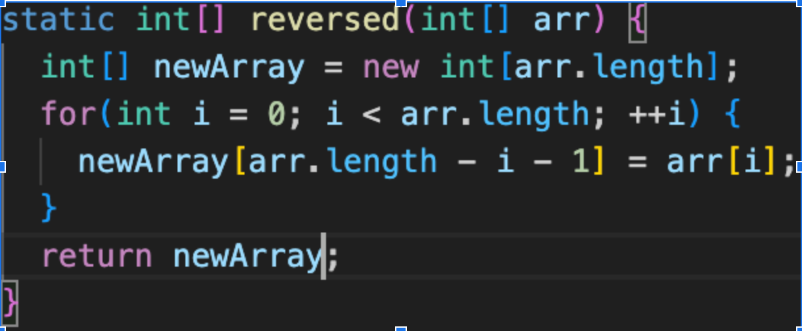
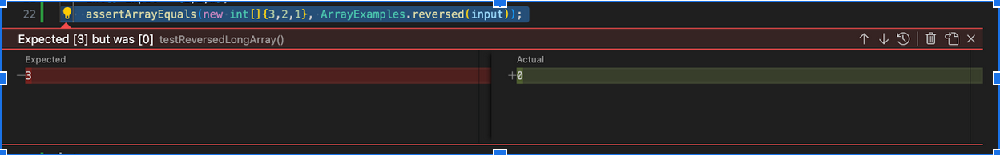

# Lab Report 5

## Part 1

### Buggy Code



### JUnit Test Fail

```
@Test
public void reveredBig() {
  int [] input = {1,2,3};
  asserEquals(new int[] {3,2,1}, ArrayExamples.reversed(input));
}
```

### JUnit Test Pass

```
@Test
public void reveredSmall() {
  int [] input = {1};
  asserEquals(new int[] {1}, ArrayExamples.reversed(input));
}
```

### Fail Output


### Bug Before Fix

```
for(int i = 0; i < arr.length; ++i) {
  newArray[arr.length - i - 1] = arr[i];
}
```

### Fixed Code
```
for(int i = 0; i < arr.length/2; i += 1) {
  int temp = arr[i];
  arr[i] = arr[arr.length - i - 1];
  arr[arr.length - i - 1] = temp;
}
```

## Part 2
